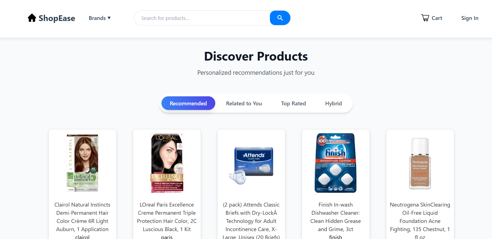

 # 🛒 Ecommerce Product Recommendation System

This is a full-stack **Ecommerce Product Recommendation System** that recommends products to users using a **hybrid approach** (content-based + collaborative filtering). Built with **React.js**, **Flask**, and **MongoDB**, the system offers personalized product recommendations based on user interactions, product descriptions, and ratings.

## 🚀 Features

- 🔐 User authentication (Sign Up, Login, Logout)
- 🛍️ Browse and search products
- 🎯 Personalized recommendations
  - Content-based filtering (based on product description & category)
  - Collaborative filtering (based on user-item interactions)
  - Hybrid recommendations
 
- 🧾 Add to cart, view details,etc

## 🛠️ Tech Stack

### Frontend
- React.js
- Axios
- Tailwind CSS 

### Backend
- Flask (Python)
- Flask-CORS
- MongoDB 

### Machine Learning
- scikit-learn
- pandas
- numpy

 
